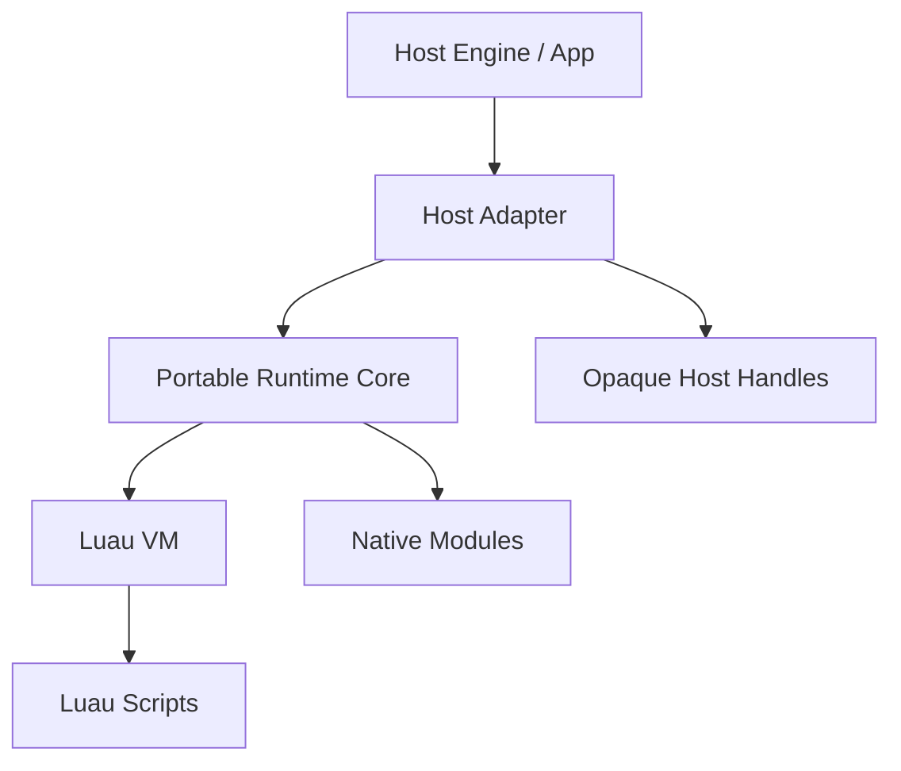
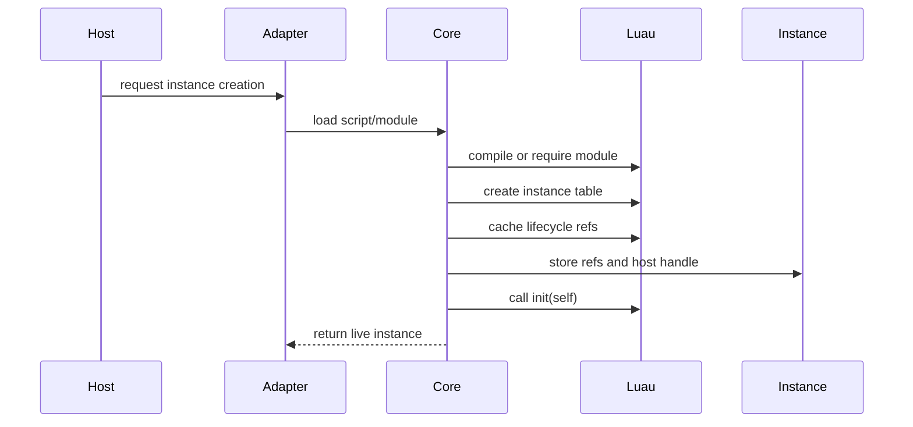

# Portable Luau Runtime Core for Rust Hosts

## Purpose

This document describes a minimal, host-agnostic Luau embedding architecture that can be reused by any Rust-based runtime host.

The file name is historical; the architecture below is not Defold-specific.

The same core shape can back:

- an egui application
- a desktop GUI host
- a desktop editor
- a test harness
- any other Rust runtime that wants Luau scripting

This is not the egui contract layer.

- `egui_component::contract::*` remains the host-side declarative UI surface for egui.
- The portable Luau runtime core owns VM concerns, script loading, lifecycle dispatch, hot reload, and deferred execution.
- Host adapters own GUI-specific APIs, input translation, and opaque native handles.

The goal is a small runtime core that can be shared across hosts without carrying egui-specific assumptions.

---

## Core Split



The architecture has three layers:

### 1. Portable runtime core

Owns:

- the shared Luau state
- compiled script and module caches
- lifecycle function references
- instance tables and registry refs
- reload bookkeeping
- deferred callback scheduling
- protected call dispatch
- error reporting and instance failure policy

### 2. Host adapter

Owns:

- host-native module implementations
- host object encoding and decoding
- input and event translation
- host scheduler integration
- file watching or asset invalidation
- any GUI/runtime-specific integration

### 3. Luau scripts

Contain the behavior that the host wants to execute.

Scripts should only depend on:

- the modules the host exposes
- the lifecycle contract
- simple plain-data events when events are used
- opaque handles when the host chooses to expose them

---

## Core Responsibilities

The portable runtime core should be responsible for these jobs and only these jobs:

1. create and own one shared Luau VM state
2. register native modules through a host-supplied registrar
3. load and compile scripts or modules
4. cache lifecycle function references
5. create and destroy script instances
6. run protected calls for lifecycle and callback dispatch
7. coordinate hot reload without restarting the VM
8. run deferred callbacks on a host-approved safe tick
9. preserve instance continuity across reloads through explicit state migration

Do not put GUI rendering code in the core.

Do not make the core depend on egui types.

Do not make the core depend on a specific widget tree representation.

---

## Host Abstractions

The runtime core should be parameterized by a small set of host abstractions instead of hard-coding platform details.

### `ScriptSourceProvider`

Provides script source, versioning, and optional dependency metadata.

Responsibilities:

- load source text
- report a stable script identifier
- report the current source version
- signal when a script or asset has changed

### `ModuleRegistrar`

Registers native modules into the Luau state.

Responsibilities:

- expose host-owned modules such as `log`, `time`, `input`, `app`, `asset`, or `gui`
- keep module registration deterministic
- avoid reflective catch-all APIs

### `HandleCodec`

Converts host-native objects into opaque Lua-visible values and back again.

Responsibilities:

- wrap handles as userdata or another opaque representation
- validate handle identity
- prevent scripts from mutating host internals directly

### `HostScheduler`

Provides a safe main-thread or safe-tick queue for deferred work.

Responsibilities:

- queue callbacks from background notifications
- flush queued work at a deterministic phase
- avoid re-entrant reload or mutation during render traversal

### `ErrorSink`

Receives structured errors from the runtime core.

Responsibilities:

- tag errors with script/module name and lifecycle phase
- report runtime errors without crashing the host
- allow the host to decide whether to disable an instance

These abstractions are small on purpose. They are enough to reuse the core in another Rust host without forcing a big framework around it.

---

## Primary Runtime Objects

### `RuntimeCore`

The `RuntimeCore` is the center of the scripting system.

Suggested shape:

```rust
struct RuntimeCore {
    state: LuauState,

    modules: ModuleRegistry,
    scripts: ScriptRegistry,
    instances: InstanceRegistry,

    deferred: DeferredQueue,

    reload_generation: u64,
    is_reloading: bool,
}
```

Responsibilities:

- own the shared Luau state
- own the module registry
- own script caches and instance bookkeeping
- manage deferred execution
- coordinate reloads

### `ScriptModule`

Represents one compiled script or loaded module.

Suggested shape:

```rust
struct ScriptModule {
    script_id: ScriptId,
    module_name: String,
    source_version: u64,

    module_ref: Option<RegistryRef>,
    init_ref: Option<RegistryRef>,
    update_ref: Option<RegistryRef>,
    event_ref: Option<RegistryRef>,
    reload_ref: Option<RegistryRef>,
    final_ref: Option<RegistryRef>,
}
```

Responsibilities:

- identify the source module
- cache lifecycle function references
- track the last successful compiled version
- keep reload state separate from instance state

### `ScriptInstance`

Represents one live script-controlled object.

Suggested shape:

```rust
struct ScriptInstance {
    instance_id: InstanceId,
    module_id: ScriptId,
    self_ref: RegistryRef,

    root: Option<HostHandle>,
    initialized: bool,
    enabled: bool,
    dirty_reload: bool,
}
```

Responsibilities:

- keep script state alive across frames
- bind the instance to a host-provided root handle when needed
- participate in update, event, and finalization dispatch
- preserve state across reloads by replacing function refs, not the VM

The exact names are not important. The separation is.

---

## Lifecycle Model

Each script should support a small fixed lifecycle.

Supported optional functions:

```lua
function init(self) end
function update(self, dt) end
function on_event(self, event) end
function on_reload(self, old_self) end
function final(self) end
```

### Semantics

#### `init(self)`

Called once after the instance table is created and any host root handle has been attached.

#### `update(self, dt)`

Called once per frame for active instances.

#### `on_event(self, event)`

Called when the host routes a semantic event to the instance.

This is optional for the minimal example and should stay adapter-driven.

#### `on_reload(self, old_self)`

Called after a successful code reload.

Use this to migrate state intentionally.

#### `final(self)`

Called before instance destruction.

Use this for host cleanup, logging, or final state snapshots.

---

## Minimal Example

Start with the smallest useful script shape: lifecycle plus state migration.

```lua
local M = {}

function M.init(self)
    self.counter = 0
end

function M.update(self, dt)
    self.counter += dt
    log.info(string.format("counter = %.2f", self.counter))
end

function M.on_reload(self, old_self)
    self.counter = old_self.counter or 0
end

function M.final(self)
end

return M
```

This example proves:

- one shared script instance
- a stable `self` table
- protected lifecycle dispatch
- reload-aware state migration
- host-owned logging through a native module

It intentionally does not prove:

- widget handles
- input routing
- GUI tree mutation
- rendering integration

Those belong to the host adapter, not the portable core.

---

## Instance Creation Flow



Implementation order:

1. load the script source or module
2. compile or require it
3. inspect exported lifecycle functions
4. create `self`
5. attach any host root handle if the adapter needs one
6. cache registry refs for functions and instance state
7. call `init(self)` if present

---

## Per-Frame Update Flow

```rust
for instance in live_instances {
    if !instance.enabled {
        continue;
    }

    run_deferred_callbacks_for(instance);
    call_update(instance, dt);
}
```

`call_update` should:

1. push the cached function ref
2. push the cached instance table
3. push `dt`
4. protected-call into Luau
5. report errors without corrupting runtime state

Use cached refs, not repeated global lookups by name.

---

## Event Dispatch Flow

Event dispatch belongs to the host adapter.

The host should perform hit testing and semantic routing first, then hand the core a plain event object if the instance should receive it.

Recommended shape:

```lua
function on_event(self, event)
    if event.kind == "click" and event.target == self.play_button then
        self.clicked = true
    end
end
```

For the minimal runtime, keep events as plain tables or other simple data structures.

If a host later needs faster event dispatch, it can move to userdata-backed events without changing the core lifecycle model.

---

## Hot Reload Architecture

Hot reload is a first-class feature.

The runtime should reload conservatively:

1. detect changed script source
2. compile the new version in isolation
3. if compile fails, keep the old version alive
4. if compile succeeds:
   - replace the cached function refs
   - mark dependent instances dirty for reload
   - call `on_reload(self, old_self)` on the next safe tick

Reload only on the main thread or another host-defined safe phase.

Do not reload while:

- event dispatch is on the stack
- render traversal is in progress
- widget or host object mutation is mid-flight

Use a queued reload request if change notification arrives at an unsafe time.

### State Migration Rule

Prefer instance state preservation, not VM patching tricks.

Recommended reload behavior:

- keep the old `self` table available temporarily as `old_self`
- refresh the function bindings
- let `on_reload(self, old_self)` copy state intentionally

Example:

```lua
function M.on_reload(self, old_self)
    self.counter = old_self.counter or 0
    self.root = old_self.root
end
```

This is simpler and safer than trying to patch closures in place.

---

## Error Handling Model

Every host-to-script call must be protected.

Requirements:

- use protected Luau calls everywhere
- annotate errors with asset/module name and lifecycle phase
- keep the runtime alive after script errors when possible
- disable only the failing instance if recovery is unclear

Preferred behavior:

- `init` failure: instance creation fails
- `update` failure: disable instance and report error
- `on_event` failure: report error, keep running if state is still valid
- `on_reload` failure: keep the old version active if swap was not committed; otherwise disable the instance
- `final` failure: report and continue cleanup

---

## Egui Adapter Sketch

`egui-component` is one possible host adapter, not the portable runtime core.

In an egui host:

- the adapter owns `egui::Context`
- the adapter owns input collection and frame timing
- the adapter owns file watching or asset invalidation
- the adapter owns widget handles or contract tree rendering
- the adapter exposes host-native modules to Luau

The Luau core should never see:

- `egui::Ui`
- `egui::Id`
- `egui::Color32`
- `egui::Stroke`
- any other immediate-mode widget detail

If the host wants to expose GUI handles to scripts, encode them as opaque userdata through the adapter.

If the host wants to render declarative UI, it can feed `egui_component::contract::*` from host state or from script output, but that is still an adapter concern.

The same core should be usable by another Rust host by swapping the adapter implementation.

---

## Recommended Code Organization

If this architecture is extracted into code later, keep the split explicit:

```text
runtime_core/
  core.rs
  scripts.rs
  instances.rs
  reload.rs
  calls.rs
  errors.rs
  deferred.rs

host_adapter/
  modules.rs
  handles.rs
  scheduler.rs
  events.rs
  asset_watch.rs
  gui_adapter.rs
```

The exact directory names are not important.

The rule is:

- core code must remain host-agnostic
- adapter code may mention egui, GUI frameworks, winit, bevy, or any other host

---

## Recommended Implementation Phases

### Phase 1: Minimal Runtime Core

Implement:

- shared Luau state
- script and module loading
- `RuntimeCore`
- one script module format
- `ScriptInstance`
- `init`, `update`, `final`
- `log` module
- protected calls
- simple file reload with full instance restart

This gets the system running quickly.

### Phase 2: Practical Hot Reload

Add:

- cached function refs
- `on_reload(self, old_self)`
- dirty reload queue
- `HostScheduler`
- `input` module if the host needs it
- opaque handle userdata

### Phase 3: Host Adapters

Add:

- egui adapter
- asset dependency tracking
- reload batching
- better state migration helpers
- error overlays in the host UI
- generated bindings for repetitive module wiring

---

## Non-Goals For The Minimal Core

Do not build these yet:

- one VM per script
- full reflection database
- generic string-based property router for all host types
- multi-language scripting support
- per-script thread isolation
- generic message bus between runtime systems
- automatic closure or state patching across reloads
- full editor tooling protocol

These additions are not needed for a reusable minimal Luau core.

---

## Final Recommendation

The implementation should follow a simplified, portable runtime model:

- one shared scripting context
- direct native modules
- cached lifecycle dispatch
- opaque host handles
- explicit reload hooks
- safe deferred scheduling
- host adapters for GUI and input

This is the smallest architecture that stays reusable across Rust-based Luau runtime contexts.
